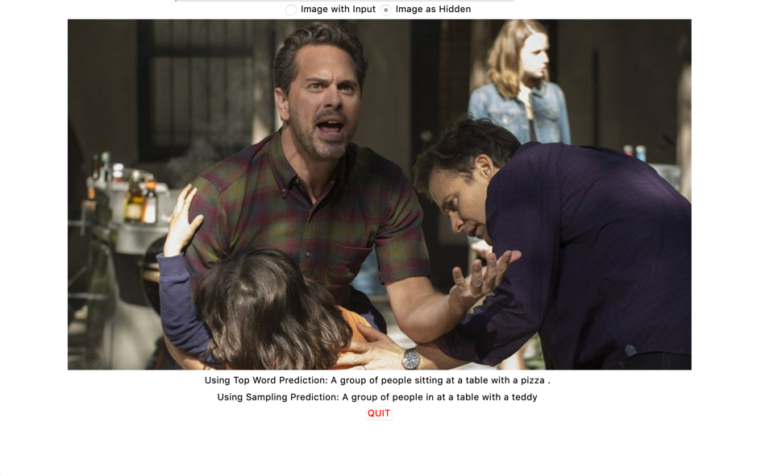
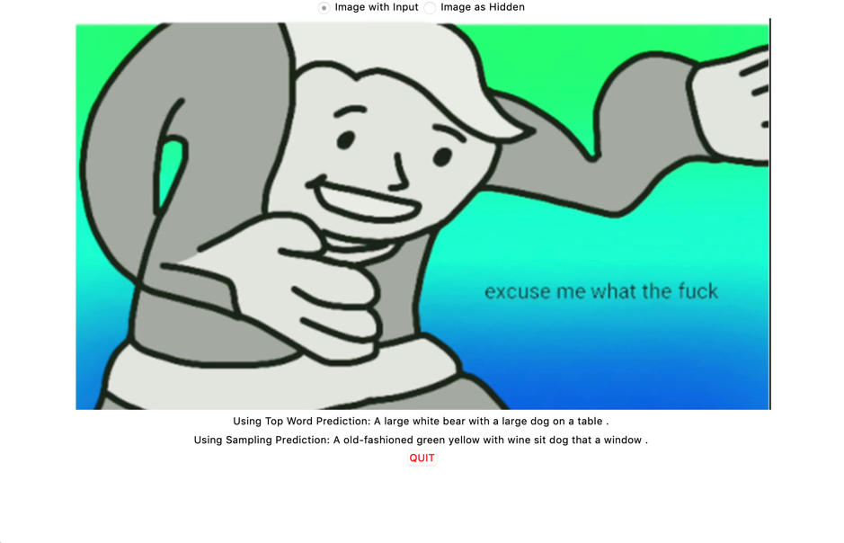
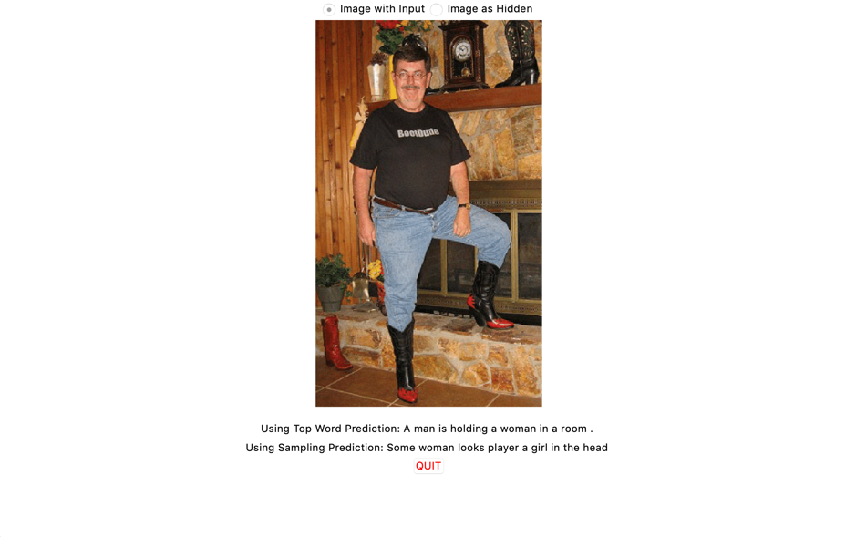

# Image Captioning Model.
Remember to change the File directory in the various python files please.<br>
Comes in two flavours. One model is the default one suggested by Yunjey at https://github.com/yunjey/pytorch-tutorial/tree/master/tutorials/03-advanced/image_captioning  the other model is one with edits in how the inputs are made.<br>
Both Models consist of a VGG 19 with Batch Normalisation frozen, save for the linear layer at the bottom, stacked with embedding and the LSTM (of editable number of layers. See train.py) and one final linear layer that maps back to the total number of vocabulary it was trained with.<br>
Currently adapted to working with MS COCO 2014 Image captioning dataset. It does NOT use COCO api, and works with raw coco data downloaded from the website.<br> 
(http://images.cocodataset.org/annotations/annotations_trainval2014.zip)<br>
(http://images.cocodataset.org/zips/val2014.zip) <br>
(http://images.cocodataset.org/zips/train2014.zip)
## Requirements
```
$ python -m pip install nltk
$ python -m pip install torch
$ python -m pip install torchvision
$ python -m pip install pillow
$ python -m pip install json
```


### Instructions
```
$ python train.py
$ python sample.py <model> <image>
```
Applies for both types of models.

## Image and caption (Download Our Model: https://drive.google.com/open?id=1gxytqy5a2fbPFWHgY5Ox1bmRadvM63Px)
This is the model suggested by Yunjey, taking in concatenated inputs of words and the image vector as inputs, and during testing, accepts only the image as input. 
## Image as hidden (Download Our Model: https://drive.google.com/open?id=1Rm50nOxe4he9jF92bL82o3r5FYf6Gw4D)
This is NOT the model that is suggested by Yunjey. It takes in inputs of the previous word/Start token. The CNN's outputs are fed in as a hidden state. (instead of cell state. oops.)<br>
## Image as cell state (Download Our Model: https://drive.google.com/open?id=1vZiPAh1rYRSUpIiTcz3_nvZ3hsTmSv2S)
This is similar to 'Image as hidden' The difference is instead of using the image as a hidden state, it is used as a cell state. (Sample captioning below does not show this model as it was added later)

## Sample Captioning


